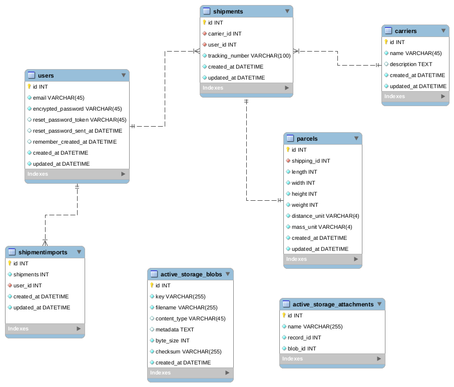

# README

Proyecto de prueba este pequeño sistema esta echo con el poder de Ruby On Rails 

* Ruby 2.6.3
* Rails 6.0.0
* SqLite

# Diagrama Base de datos

Para el diagrama de la base de datos se uso Mysql Workbrench

